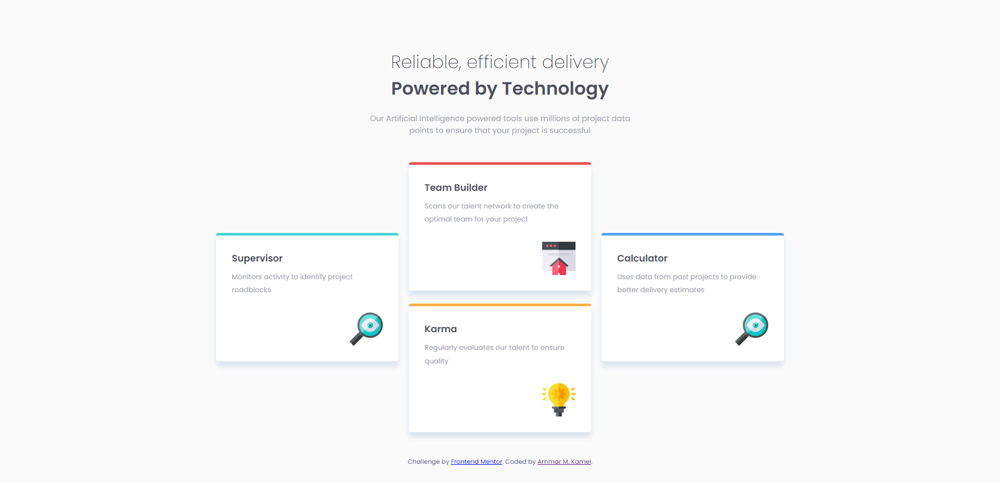

# Frontend Mentor - Four card feature section solution

This is a solution to the [Four card feature section challenge on Frontend Mentor](https://www.frontendmentor.io/challenges/four-card-feature-section-weK1eFYK). Frontend Mentor challenges help you improve your coding skills by building realistic projects. 

## Table of contents

- [Overview](#overview)
- [Screenshot](#screenshot)
- [Links](#links)
- [Built with](#built-with)
- [Useful resources](#useful-resources)
- [Author](#author)

## Overview

- This is a simple HTML and CSS Project.
- It represents the AI tools of a company and their features.

## Screenshot

## Links

- Solution URL: [GitHub Repo](https://github.com/AmmarMKamel/four-card-feature-section)
- Live Site URL: [Four Card Feature Section](https://ammarmkamel.github.io/four-card-feature-section/)

## Built with

- Semantic HTML5 markup
- CSS custom properties
- CSS Flexbox
- CSS Grid
- Mobile-first workflow

## Useful resources

- [Cards Layout](https://developer.mozilla.org/en-US/docs/Web/CSS/CSS_Grid_Layout)

## Author

- GitHub - [AmmarMKamel](https://github.com/AmmarMKamel)
- Frontend Mentor - [@AmmarMKamel](https://www.frontendmentor.io/profile/AmmarMKamel)
- Linkedin - [Ammar Kamel](https://www.linkedin.com/in/ammar-kamel-872422246/)